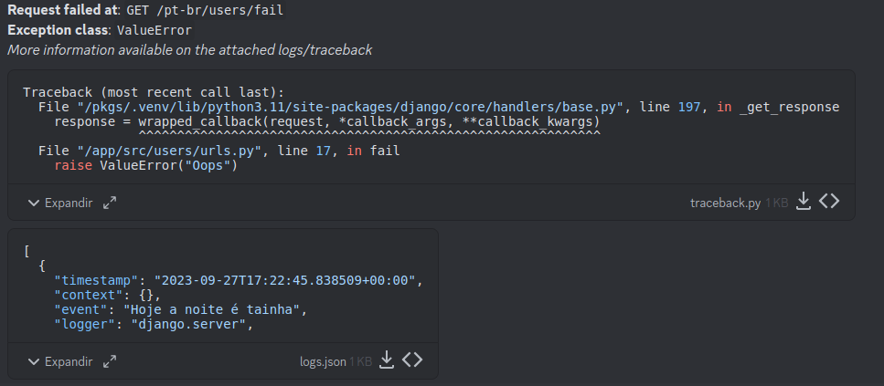
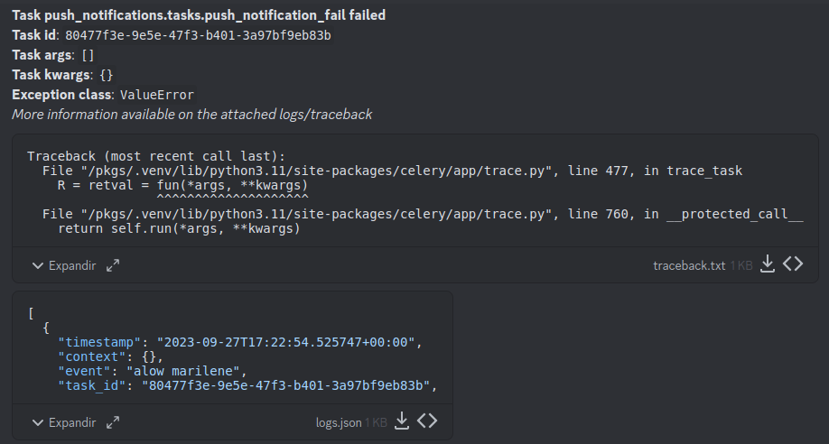

# Style Guide e Boilerplate de Projetos Django - Plathanus


> Com pressa para inicar o projeto? Vá direto para a seção de [inicialização do projeto](#iniciando-a-aplicação-locamente).

Este documento visa definir e documentar o processo de desenvolvimento para projetos Django dentro da **Plathanus**. É um guia com opiniões fortes sobre como, onde e quando as coisas devem ser feitas. Este guia foi inspirado pelo [Style Guide da HackSoftware](https://github.com/HackSoftware/Django-Styleguide), é um ótimo guia sobre style-guide para aplicações, recomenda-se que você leia todo o style guide antes de ler este style guide. Algumas das idéias presentes no style guide da HackSoftware serão repetidas aqui, outras serão diferentes.


## Motivação

É comum projetos terem a identidade dos desenvolvedores que nele atuam, mas conforme a equipe aumenta fica cada vez mais difícil manter a consistência entre os desenvolvedores. Este guia visa dar a identidade **Plathanus** aos projetos que usam Django.

## Considerações

O Django é um framework muito maduro, portanto seus casos de uso são muito extensos e muitas vezes podemos utilizá-lo em várias áreas diferentes.

### Quando usar o Django

Aqui estão listadas algumas das principais forças que o Django concede aos desenvolvedores, e que são os pontos forte para uma aplicação robusta.

- É necessário um backoffice para o gerenciamento de conteúdo de uma aplicação web/mobile. Neste caso, o Admin se tornará um grande aliado.
- O modelo de processamento síncrono atende ao cliente, não são necessários SSE (Server Side Events), Comunicação em Tempo Real (Websockets).
- Serão necessárias APIs para servir a um frontend web ou mobile.
- A interface gráfica pode ser renderizada diretamente no servidor, e a interatividade gerenciada por um microframework JS como (HTMX, Alpine.js, HyperScrypt).
- Uma aplicação com muitos CRUDs ou comunicação com o banco de dados. O ORM será um grande aliado.

### Quando não usar o Django

Aqui estão listadas algumas das principais fraquezas do Django, que podem ser contornadas com bibliotecas de terceiros, porém não "brilham", ou tem um tradeoff grande de performance.
- A interface de Backoffice é complexa e necessita de uma interatividade alta, neste caso o Admin não é o suficiente.
- É necessário um modelo dados "solto" ou dinâmico, utilizando como banco de dados o MongoDB por exemplo.
- Inteligência Artificial.
- Uma aplicação que necessite de tempos de resposta inferiores a 100ms (Seria melhor utilizar um framework JS ou uma linguagem compilada neste caso).

Algumas destas fraquezas do Django se devem ao fato do processamento de dados ser assíncrono, estas utilizarão a abstração ASGI em vez de WSGI. Essa tecnologia é relativamente nova em relação ao WSGI, e sofrem de performance ou da necessidade de alterações grandes na maneira como o código é desenvolvido. Portanto, ao iniciar um projeto que necessite de ASGI, talvez seja melhor utilizar um outro framework para lidar com este tipo de comunicação, e o Django para a comunicação síncrona (WSGI).

## Como usar este guia

Siga de perto as instruções listadas neste guia, estas referências serão revistas em PR e Issues. Como citado, queremos garantir que este guia tenha instruções claras que dêem a "cara da Plathanus" ao código.

## Regras de negócio

É bom quando em uma aplicação que as regras de negócio estejam bem descritas e que estejam centralizadas em um único local, ou em poucos locais. Isso facilita a manutenção, e dependendo do nível de abstração seja possível até mesmo que o cliente possa ver o código e avaliar a regra de negócio implementada.

Onde as regras de negócio devem estar, em ordem de prioridade:

- *Services*: funções que escrevem, validam, escrevem no banco de dados e fazem ações adicionais, como chamar services externos de integração (Push Notifications, SMS, Email, etc);
- *Selectors*: funções que fazem buscas no banco de dados, e podem aplicar regras condicionais dependendo do usuário, por exemplo;
- *Propriedades nos Models*: Funções que são tratadas como um atributo, e podem aplicar regras baseadas no estado atual da instância do banco de dados;
- *Método `clean` do Model*: Função dentro do model que realiza uma validação antes de salvar os dados no banco de dados, garantindo a integridade a nível de informação. Tenha em mente que neste método nem todos os campos (`fields`) estarão com dados válidos, neste boilerplate há um outro método que lida apenas com dados válidos `clean_valid_data`.

Por outro lado, as regras de negócio **NÃO** devem estar:

- *APIs e Views*: Colocar uma regra de negócio em uma destas camadas resultaria em duplicação de código para atender a uma outra camada de apresentação. Por exemplo, se a regra de negócio está em uma view (que renderiza um template), e for necessário que esta regra seja aplicada também a uma API seria necessária duplicar esta regra em dois lugares diferentes;
- *Serializers e Forms*: Apesar de serem ótimos para validação de dados, o mesmo caso acima se aplica a estes componentes da aplicação;
- *Template Tags*;
- *Método `save` do Model*;
- *Classes `Manager` ou `QuerySet` customizadas*;
- *Sinais (`Signal`) do Django*.


### Por quê?

Caso queira uma explicação do por quê de cada um dos componentes acima não ser o ideal para abrigar as regras de negócio, consulte [esta seção](https://github.com/HackSoftware/Django-Styleguide/blob/master/README.md#why-not) Style Guide da HackSoftware.
Como mencionado, duplicar as regras de negócios gera problemas tanto de manutenção quanto de bugs difíceis de encontrar. Portanto, por mais que seja tentador usar as Abstrações do Django para CRUD como a `ModelViewSet` para APIs por exemplo, assim que a aplicação necessitar mais do que um simples CRUD as coisas ficam complicadas e não se sabe onde ou o que deve ser sobrescrito.  Portanto neste guia, vamos considerar como manter cada coisa no seu devido lugar e responsabilidade, o que ajudará na manutenção e testabilidade do código.

## Models

**Responsabilidade principal:** Definir o modelo de dados e a sua integridade.

### Utilizando o BaseModel

Seguindo o princípio de DRY (Don't Repeat Yourself) definir um modelo base com alguns campos é sempre uma boa idéia. Alguns campos que geralmente são utilizados em quase todos os models são: `created_at` e `updated_at`. Por este motivo, este boilerplate já vem com um `BaseModel` e um `AutoTimeStampModel`, você pode importá-los do seguinte módulo: `app.models.base`.

Seus `models` **DEVEM** herdar ou do `BaseModel` ou do `AutoTimeStampModel`.

```python
from app.models.base import BaseModel

class SomeModel(BaseModel):
  # Your definitions goes here
```

É importante estar ciente do que o `BaseModel` tem de diferente do `Model` do Django. Esta classe tem funcionalidades extras, um hook `clean_valid_data` que será chamado pelo método `full_clean`. Este hook é parecido com o hook `clean` do Django (*que também pode ser implementado na sua classe*), mas que só é executado quando nenhum erro é levantado previamente, seja na validação dos campos, ou até mesmo de um `Form` que esteja sendo validado. Esse hook foi criado para que a validação possa acontecer sem que seja necessário se preocupar se os valores dos campos estão de acordo com os metadados de validação dos campos (o que não acontece no hook `clean`). Caso queira uma explicação detalhada, você pode consultar este [post](https://forum.djangoproject.com/t/model-clean-after-errors-on-model-full-clean/23990).

Portanto, **dê preferência** por implementar o hook `clean_valid_data` em vez do `clean`.


### Fields, classe Meta e Métodos

* Todos os `field` do modelo **devem** conter um `verbose_name` traduzível utilizando o `gettext_lazy`. Este `verbose_name` deve sempre conter todas as letras em minúsculo.

> Isso tem a ver com a seção de internacionalização, mencionada a frente. Mas em resumo isso garante que se uma mensagem for exatamente igual a outra, exemplo: "date" não seja necessário duas traduções para o mesmo texto.

Exemplo:
```python
from django.utils.translation import gettext_lazy as _

some_field = models.CharField(verbose_name=_("some field"))
```

* Alguns campos podem ser melhor definidos com um texto mais longo, neste caso utilize a opção `help_text`, as diretivas para o valor desta opção são as mesmas de `verbose_name`

* Como via de regra **todo modelo deve** ter um método `__str__` que retorne sempre uma `str`. Tome cuidado ao utilizar campos que tenham `null=True`.

No exemplo abaixo, isso poderia gerar um erro não esperado caso o campo `name` tenha um valor nulo no banco de dados.
```python
from django.db import models


class Person(BaseModel):
  name = models.CharField(verbose_name=_("name"), null=True)

  def __str__(self):
    # BAD
    return self.name

  def __str__(self):
    # GOOD, always returns a string
    return self.name or "Unknown"
```

*  Como via de regra **todo model deve conter** uma classe `Meta` que defina um `verbose_name` e um `verbose_name_plural`, as diretivas para os valores desta opção são as mesmas de `verbose_name` nos `field` do model.

Abaixo segue o exemplo da classe `Person`, com a classe `Meta` definida:

```python
from django.db import models
from django.utils.translation import gettext_lazy as _

class Person(BaseModel):
  name = models.CharField(verbose_name=_("name"), null=True)

  class Meta:
    verbose_name = _("person")
    verbose_name_plural = _("people")
```

### Hierarquia de definições

Um model deve definir de cima para baixo os seguintes componentes:
* Os `fields`;
* Tipagem de fields com acessores reversos (`OneToOneField`, e `ForeignKeyField`);
* Classe `Meta`;
* Método `__str__`;
* Método `clean_valid_data` / `clean` (se houver);
* Propriedades;

### Campos Estrangeiros

Todo campo estrangeiro (`ForeignKey` / `OneToOneField`) deve definir a opção `related_name` para que seja criado um acessor reverso em seu outro modelo e este também deve ser tipado, se o acessor for ser utilizado. Em alguns casos, cria-se uma `ForeignKey` mas seu acessor reverso não será utilizado, neste caso, não é necessário tipar o acessor.

```python

from django.db import models
from django.utils import timezone
from django.utils.translation import gettext_lazy as _

class Person(BaseModel):
  name = models.CharField(verbose_name=_("name"), null=True)

  # Typed the reverse acessor (one-to-many)
  pets: models.QuerySet["Animal"]

  class Meta:
    verbose_name = _("person")
    verbose_name_plural = _("people")

  def __str__(self):
    return self.name or "Unknown"


class Animal(BaseModel):
  owner = models.ForeignKey(to=Person, on_delete=models.CASCADE, related_name="pets")

  # Typed the database column
  owner_id: int

  # Typed the reverse acessor (one-to-one)
  house: "AnimalHouse"


class AnimalHouse(BaseModel):
  animal = models.OneToOneFiled(to=Animal, on_delete=models.CASCADE, related_name="house")

  # Typed the database column
  animal_id: uuid.UUID
```

### Integridade de dados

É muito importante que nossas aplicações tenham dados íntegros, isso está diretamente relacionado com o tópico `Database Normalization`, caso queira saber mais sobre este tópico esta é uma ótima [série de vídeos](https://www.youtube.com/watch?v=GFQaEYEc8_8&list=PLNITTkCQVxeXryTQvY0JBWTyN9ynxxPH8&pp=iAQB) sobre o assunto.

Portanto é importante que conhecer bem esta camada e como o ORM do Django ajuda o desenvolvedor a garantir a integridade das informações. Portanto, um desenvolvedor deve definir tudo relacionado à integridade de suas entidades diretamente na camada de models.

Algumas considerações:

* Independente da informação que a aplicação irá guardar, um model **sempre deverá** ter o `id` como Primary Key. O BaseModel definido acima garante isso. Caso alguma informação da tabela seja única, utilize a opção `unique=True` ao definir o `field`.
* Campos que são únicos em conjunto devem ser definidos como `unique_together` na opção `constraints` na classe `Meta` do model.

### Validação de dados

É muito importante que nossas aplicações validem os dados antes que eles sejam salvos no banco de dados. Para isto a função `clean_valid_data` do model é um ótimo candidato. Vamos definir a classe `Person` novamente, e adicionar uma validação para a data de cadastro.

```python
from django.core.exceptions import ValidationError
from django.db import models
from django.utils import timezone
from django.utils.translation import gettext_lazy as _

class Person(BaseModel):
  name = models.CharField(verbose_name=_("name"), null=True)
  # new field
  date_joined = models.DateField(verbose_name=_("date joined"))

  class Meta:
    verbose_name = _("person")
    verbose_name_plural = _("people")

  def __str__(self):
    return self.name or "Unknown"

  def clean_valid_data(self):
    today = timezone.now().date()
    if self.date_joined > today:
      raise ValidationError("You can't join in the future!")

```

Note que no método acima a função `clean_valid_data` tem a responsabilidade de garantir que um usuário não se registre na aplicação no futuro, outras regras semelhantes referentes a integridade dos dados podem ser inclusas nesta função. Com a exceção de que caso a validação inclua chamadas à services externos, esta deve ser feita na camada de services.
É importante que o erro que seja levantado (`raise`) seja do tipo `ValidationError` pois isso combinará com o tratamento de erros do Django no Admin, nos Forms e nos Serializers.

Porém para garantir que esta validação seja feita é necessário que a função `full_clean` seja chamada pelo desenvolvedor que está prestes a salvar a entidade. Esse processo é feito automaticamente nos `ModelForm` e `ModelSerializer`, porém na maioria das vezes o processo de criação, ou atualização das entidades deverá ocorrer na camada de services. Portanto, como um exemplo, está definido abaixo uma função de service que cria uma pessoa, chamando método `full_clean` e garantindo que a validação seja feita.

```python
from datetime import date

from people.models import Person

def person_create(*, date_joined: date, name: str | None) -> Person:
  person = Person(name=name, date_joined=date_joined)
  person.full_clean()
  person.save()

  # Do some extra stuff
  return person
```

Outro benefício de chamar a função `full_clean` é que as `constraints` de `unique` e `unique_together` são validadas, e caso alguma delas falhe o Django irá levantar um `ValidationError` também, mais sobre na documentaçao de [validação de objetos](https://docs.djangoproject.com/en/4.2/ref/models/instances/#validating-objects).

Outra forma de realizar a validação de dados é através da opção `constraints` na classe `Meta` do model. Isso é feito através das `CheckConstraint`, que apesar de úteis muitas vezes podem se tornar complexas, portanto dê preferência por utilizar os hooks `clean_valid_data` ou `clean`.
A [documentação](https://docs.djangoproject.com/en/4.2/ref/models/constraints/#checkconstraint) de `CheckConstraint` dá alguns exemplos de como utilizar a funcionalidade. Estes artigos também podem ser de ajuda:

* [Using Django Check Constraints to Ensure Only One Field Is Set](https://adamj.eu/tech/2020/03/25/django-check-constraints-one-field-set/)
* [Django’s Field Choices Don’t Constrain Your Data](https://adamj.eu/tech/2020/01/22/djangos-field-choices-dont-constrain-your-data/)
* [Using Django Check Constraints to Prevent Self-Following](https://adamj.eu/tech/2021/02/26/django-check-constraints-prevent-self-following/)

### Propriedades do model

As propriedades são ótimas maneiras de incluir funcionalidade ao model, pois funcionam como um atributo do model e portanto podem ser utilizados no Admin, e nos Serializers. Porém, é importante seguir algumas regras antes de definir uma propriedade.
Aqui estão alguns bons exemplos de uso de uma propriedade:
- Você precisa de um valor derivado de um ou mais campos do seu modelo, mas nenhum parâmetro é necessário;
- Não se faz necessário o acesso à modelos relacionados/estrangeiros;
- O cálculo do valor é algo simples, rápido e "barato" em questão de processamento.

Caso a funcionalidade que você deseja implementar não se encaixe em alguma destas regras, não use uma propriedade, mas sim um método normal (definido abaixo). Utilizando o exemplo de `Person`, aqui estão algumas propriedades que podem ser implementadas:

```python
from datetime import timedelta
from django.utils import timezone

class Person(BaseModel):
  name = models.CharField(verbose_name=_("name"), null=True)
  date_joined = models.DateField(verbose_name=_("date joined"))

  class Meta:
    ...

  def __str__(self):
    ...

  def clean(self):
    ...

  @property
  def is_recent_joiner(self):
    today = timezone.now().date()
    last_week = today - timedelta(days=7)
    return self.date_joined >= last_week

  @property
  def is_known(self):
    return self.name is not None

```

Perceba que as `property` adicionam funcionalidade ao nosso model, mas são fáceis de calcular e não acessam nenhum modelo estrangeiro.

### Métodos do modelo

Métodos de modelo são ótimos quando precisamos garantir que campos sejam atualizados em conjunto, ou quando precisamos realizar um cálculo com base nos campos da entidade com parâmetros. Aqui estão algumas regras antes de definir um método no modelo.

- Você precisa de um valor derivado de um ou mais campos do seu modelo, mas um parâmetro é necessário;
- Não se faz necessário o acesso à modelos relacionados/estrangeiros;
- O cálculo do valor é algo simples, rápido e "barato" em questão de processamento.
- Caso esteja alterando um campo e outro campo deve ser alterado em conjunto.

Caso a funcionalidade que você deseja não se encaixe em alguma destas regras, defina um método de service ou selector.


### Testes do modelo

Não é necessário testar cada field do modelo, isso já é feito pelo Django. Porém você **deve criar testes** caso você tenha adicionado ao modelo alguma das funcionalidades abaixo:

- Um hook `clean_valid_data` ou `clean`;
- Uma propriedade;
- Um método;
- Uma constraint;

> Testes para estas funcionalidades específicas.


## Services

Onde as regras de negócio vivem, é aqui que acontecerá as principais funcionalidades do sistema, a comunicação com o banco de dados (escrita em maioria), com services externos, despacho de tarefas assíncronas.
A idéia é concentrar as regras de negócio nesta camada para que outras camadas da aplicação consumam desta camada centralizada.

Um `service` pode ser:
- Uma função;
- Uma classe;
- Um módulo python com várias funções.

O desenvolvedor deve usar de bom-senso para escolher o que melhor se encaixa no contexto e necessidades. Porém na maioria dos casos um `service` será uma função python que:

* Estará localizada em `<app_name>/services.py`;
* Recebe **apenas** argumentos nomeados, há menos que não seja necessário nenhum argumento, ou apenas um argumento;
* É fortemente tipada, seus argumentos e retorno;
* Irá interagir com o banco de dados, um serviço externo, ou outras partes da aplicação.
* Aplica uma ou mais regras de negócio. Como chamar um serviço externo ou despachar tarefas assíncronas.

Considerando estas premissas, um exemplo de função de serviço para a criação de um pessoa (`Person`) pode ser definido como:

```python
from datetime import date

from people.models import Person


def person_create(*, name: str | None, date_joined: date) -> Person:
  person = Person(name=name, date_joined=date_joined)
  person.full_clean()
  person.save()

  send_customer_welcome_email(person=person)
  do_some_stuff_with_person(person=person)

  return person
```

Como é possível ver, este serviço agrupa toda a lógica de criação de uma pessoa e o que acontece quando esta é criada. Isso incluiu neste caso chamar outros services.

Mas e se caso alguma lógica seja duplicado entre duas funções de serviço? Nesse caso talvez seja melhor utilizar uma classe e criar um método privado para a lógica semelhante. [Exemplo](https://github.com/HackSoftware/Django-Styleguide-Example/blob/master/styleguide_example/files/services.py).


### Convenção de nomenclatura

Caso o serviço seja uma função **deve seguir** a seguinte nomenclatura: `<entity>_<action>`
Caso o serviço seja uma classe, então **deve seguir** a seguinte nomenclatura: `<Entity><Action>Service`.

### Módulos de serviço

Conforme a aplicação cresce pode ser que apenas um arquivo `services.py` fique "pequeno", com muitas linhas de código, nesse caso é possível também transformar o arquivo `services.py` em um módulo e dentro deste módulo separar as funções relacionadas em sub-módulos.
Isso fica a cargo do desenvolvedor e de como se sente em relação ao arquivo `services.py`, talvez o desenvolvedor entenda que um bom momento para transformar o arquivo em um módulo é quando o número de linhas chega próximo das 500-1000 linhas.


### Injeção de dependências

A injeção de dependências é uma das práticas de software mais importantes que um desenvolvedor deve dominar, pois ela permite que o desenvolvedor teste mais facilmente seu código, mude o comportamento da sua aplicação dependendo do ambiente em que ela esteja sendo executada.
Em resumo injeção de dependência é quando você recebe um `objeto` instanciado anteriormente, em vez de instanciá-lo dentro do método que o usa.
Aqui está um vídeo que explica este tópico: [Dependency Injection, The Best Pattern](https://www.youtube.com/watch?v=J1f5b4vcxCQ&pp=ygUUZGVwZW5kZW5jeSBpbmplY3Rpb24%3D)

Veja um exemplo de um service que **não** usa injeção de dependência, ela irá utilizar o serviço de envio de SMS.

```python
from app.ext.sms.backends.twilio import TwilioSMSExternalService

def person_spam(person):
  sms_service = TwilioSMSExternalService()
  sms_service.send(...)
```

Perceba que a classe `TwilioSMSExternalService` é criada dentro do método `person_spam`. Isso não permite que o comportamento da função seja diferente em nenhuma situação, vamos sempre usar o serviço da Twilio. Mas quando estiver escrevendo e rodando os testes, você com certeza não quer que sejam enviados SMS's. Em teste sua única opção seria `mocking` (boa sorte!). Da mesma maneira, enquanto estiver com a aplicação em desenvolvimento, você seria obrigado a ter uma conta na twilio (com créditos) para usar esta funcionalidade. Por isso, vamos ver a mesma função, só que desta vez com injeção de dependência.

```python
from app.ext.sms.abc import SMSExternalService

def person_spam(*, person, sms_service: SMSExternalService):
  sms_service.send(...)
```

O que mudou? O método `person_spam` agora recebe um serviço de envio de SMS, o serviço não faz ideia qual fornecedor está sendo usado (e ele não precisa), e por isso, para testar esta função, você precisa apenas passar um serviço que respeite as mesmas diretrizes de `SMSExternalService`. Então o objeto `sms_service` será criado uma camada antes: numa view, api_view, task, etc. A criação deste serviço externo é delegada para uma função que utiliza as configurações do Django para definir qual fornecedor irá ser utilizado (Mais informações sobre serviços externos, estão na seção de [integrações externas](#integrações-externas)).

> É muito chato ter que ficar criando os serviços externos nas outras camadas, tem um jeito mais fácil?

Sim, este boilerplate já vem com algumas funcionalidades de injeção de dependência, elas estão disponíveis no módulo `app.ext.di`. Portanto, para injetar automaticamente um fornecedor de serviço externo, você pode utilizar o decorator na sua função de serviço, e o serviço será injetado automaticamente na sua função de serviço (caso você não passe ele explicitamente). Sua função ficaria assim:

```python
from app.ext.sms.abc import SMSExternalService
from app.ext.di import inject_service_at_runtime

@inject_service_at_runtime(SMSExternalService)
def person_spam(*, person, sms_service: SMSExternalService):
  ...
```
Este decorator irá encontrar o parâmetro que tem a mesma tipagem que o serviço que deve ser injetado e quando a função for chamada, injetará uma instância do objeto daquela classe na função, se a função foi chamada sem o argumento que deve ser injetado.


### Logs

Nesta camada da aplicação é importante ter logs "razoáveis", por isso aproveite ao máximo as funcionalidades builtin do python, como os níveis de log, que são facilmente configurados via variáveis de ambiente.

> Caso algum erro aconteça em seu serviço, o melhor a fazer é reportar este erro. Veja a seção [Report de erros](#loggingreport-de-erros)


### Testes

Como aqui será a parte mais importante da sua aplicação, onde todas as regras de negócio estarão, escreva testes extensivos para esta camada. Cada exceção que for levantada, deve ter um teste correspondente. Cada ramificação `if`, e assim por diante. Se você seguir as diretrizes deste style guide, testar esta camada será simples!


## Selectors

O outro lado da moeda dos services. Enquanto os services são geralmente focados na escrita ao banco de dados, os selectors ficam do lado da leitura do banco de dados. Os selectors são especialistas em como trazer as informações do banco. De preferência estes selectors irão retornar `QuerySet`s, pois são muito flexíveis ao que o desenvolvedor deseja / precisa. Mas é possível retornar listas, tuplas ou sets, o que for mais conveniente.

Para a convenção de nomes pode-se utilizar o mesmo padrão de services.

## Integrações externas

É comum integrar uma aplicação com serviços externos, como pagamentos, notificações, email, etc. Sempre que uma integração for realizada com um serviço externo, não devemos criar uma dependência direta com este serviço, mas sim criar uma abstração para este serviço externo.

A maioria das integrações externas deverão ser colocadas em uma pasta dentro do módulo `app.ext`.
Por exemplo, caso você adicione uma integração com um serviço de pagamentos, a árvore de arquivos seria:

```
app
├── ext
  ├── payment
    ├── __init__.py
    ├── abc.py
```

> Caso a integração seja especifíca de uma aplicação Django, então as integrações poderão residir no módulo da própria aplicação, mas geralmente uma integração é utilizada em mais de uma aplicação django.

Onde em `abc.py` será definido a interface de comunicação com o serviço externo. Esta classe deve herdar da classe `ExternalService`, definida em `app.ext.abc`. Nesta classe, será definido a interface de comunicação, métodos, atributos, etc. É nesta classe que você irá definir o `service_loader`: uma função que tem a responsabilidade de criar uma instância concreta de uma integração com um fornecedor específico.

Exemplo:

```python
from app.ext.abc import ExternalService


def payment_service_loader() -> "PaymentExternalService":
  ... # implemented later

class PaymentExternalService(ExternalService):
  service_loader = payment_service_loader
  def charge(*, amount: int) -> None:
    raise NotImplementedError("Missing implementation for method send")

```

Esta classe **deve seguir** a nomenclatura `<funcionalidade>ExternalService`.

Perceba que nesta classe estão apenas as definições de quais métodos a classe terá, não a implementação destes. Cada uma das implementações de fornecedores externas deverão estar no mesmo módulo (`payments` neste caso), dentro de um módulo chamado `backends`. Use como referência os serviços de SMS e Notificações Push já implementados. Após definir as integrações externas com os fornecedores e possivelmente um `backend` de dados "Fake" ou "Estáticos" para ser uitlizado em ambiente de testes/local. Poderá implementar a função que será definida no atributo `service_loader`.

Digamos que tenha implementado um método de pagamento na `stripe` e `fake`, seu `service_loader` irá se parecer com:

```python
from django.conf import settings


def payment_service_loader() -> "PaymentExternalService":
  from .backends.stripe import StripePaymentExternalService
  from .backends.fake import FakePaymentExternalService

  backends = {
    "stripe": StripePaymentExternalService,
    "dev.fake": FakePaymentExternalService
  }
  return backends[settings.PAYMENT_EXTERNAL_SERVICE_BACKEND]()

class PaymentExternalService(ExternalService):
  service_loader = payment_service_loader

  # same as before ...
```

Algumas considerações:
* Serviços para desenvolvimento **devem sempre** iniciar com `dev.`;
* O nome da configuração para o serviço externo **deve sempre** ser `<funcionalidade>_EXTERNAL_SERVICE_BACKEND`.

As configurações dos serviços externos estão definidas na seção [Configurações](#configurações)


## Logging/Report de erros

Este boilerplate já vem integrado com um report de erro, que envia uma mensagem com alguns dados da requisição/tarefa que falhou, bem como todos os logs vinculados, e o traceback.

Por isso para aproveitar ao máximo o report de erros, **sempre utilize** o logger vindo da função de utilidade `get_logger` disponível no módulo `app.logging.utils`. Isso garante que todos os logs estejam disponíveis nos reports de erros.

É possível criar uma variável a nível de módulo, como no exemplo abaixo:
```python
from app.logging.utils import get_logger

LOGGER = get_logger(__name__)

def some_service():
  logger = LOGGER.new(foo="bar")
```

Ou por função:
```python
from app.logging.utils import get_logger

def some_service():
  logger = get_logger(__name__, foo="bar")
```

Perceba que é possível passar variáveis de contexto, isso facilita o debug em casos de erro. Isso é possível por que por baixo dos panos estamos utilizando a lib [struclog](https://www.structlog.org/) com algumas modificações importantes.

Utilizamos [variáveis de contexto](https://docs.python.org/3/library/contextvars.html) para armazenar todas as chamadas de logs que se encaixam nos filtros de nível (level) de logging.

* A cada requisição essas chamadas de logs que ficaram armazenadas na memória são resetadas por um [middleware](./src/app/middlewares/log.py).
* A cada tarefa recebida essas chamadas de logs que ficaram armazenadas na memórias são resetadas por um [signal](./src/app/celery/app.py).

 > Isso garante que apenas as chamadas de logs da requisição/tarefa atual sejam reportados (ContextVars são thread-safe).

Portanto, para configurar o report de erros, siga os seguintes passos:

* Defina o valor da variável de ambiente `SEND_ERROR_REPORT_ON_FAILURES` para um valor verdadeiro (`1`, `y`, `Yes`)
* Defina o valor da variável de ambiente `MESSAGING_EXTERNAL_SERVICE_BACKEND` para o fornecedor de preferência (atualmente apenas o `discord` pode ser utilizado em produção).

De acordo com cada fornecedor, será necessário seguir passos diferentes. Abaixo estão os guias para cada um dos fornecedores.

* `discord`: Será necessário [criar uma conta de BOT](https://discord.com/developers/docs/getting-started) no e convidá-lo ao servidor que serão enviadas as mensagens. Após a criação da conta, será necessário que você inclua o Token de autenticação do Bot na variável de ambiente `MESSAGING_EXTERNAL_SERVICE_DISCORD_OAUTH_TOKEN`, **não prefixe** esta variável de ambiente com `Bot`.

Após a configuração do seu fornecedor de preferência, defina as variáveis de ambiente:

* `ERROR_REPORT_REQUEST_CHANNEL_ID` Para o ID do canal/usuário que irá receber a mensagem quando uma requisição falhar;
* `ERROR_REPORT_TASK_CHANNEL_ID` Para o ID do canal/usuário que irá receber a mensagem quando uma tarefa falhar;


Por último tenha certeza de que a configuração `DEBUG` está desativada (`False`), essa configuração é definida pela variável de ambiente `DJANGO_DEBUG`.

Opcionalmente é possível definir o idioma de envio dos reports de erro através da variável de ambiente: `SEND_ERROR_REPORT_ON_LANGUAGE`.

Após tudo configurado, as mensagem irão se parecer com isto.

Falha em uma requisição:


Falha em uma tarefa:


## APIs

As APIs são uma das portas de entrada para a aplicação, mas não devem ser mais do que isso. Portanto toda aqui não veremos quase nenhuma regra de negócio.


### Estrutura de pastas

Todas as APIs devem estar dentro da `src/api`, seguidas da pasta com o `nome do app django` e da pasta com sua respectiva versão (`v1`, `v2`, etc). Dentro da pasta de cada versão estarão definidos alguns arquivos:

- `urls.py`: Mapeamento das URLs com as Views para esta versão;
- `schemas.py`: Estruturas de entrada e saída de dados da API (`Serializers`);
- `views.py`: View que vão receber os dados e chamar os `services`/`selectors`.

### Serializers

Os serializers (schema) são definidos dentro arquivo `schemas.py` para que não cause conflitos com o módulo `serializers` do rest_framework. Algumas considerações sobre os schemas:
- Um schema **deve definir** o modelo de entrada ou de saída, mas nunca os dois.
- Um schema **deve ser** nomeado utilizando a nomenclatura `<acao_da_view><input|output>Schema`. Ou seja, caso tenha uma view chamada: `PersonCreateView`, o seu schema de entrada será: `PersonCreateInputSchema`, e o seu schema de saída será: `PersonCreateOutputSchema`.

Tente reaproveitar ao máximo os campos do seus models, usando o `ModelSerializer`, mas tome cuidado ao utilizar campos do Modelo ao criar instâncias, já que a validação passará antes pelo Serializer do que sua camada de serviço.

Visto que as regras de negócios são definidas na camada de services, você **não deve criar ou atualizar objetos utilizando** o método `save`. Use um serviço para isso.

O método `validate` pode ser usado quando necessário validar campos conjuntos de entrada, mas não devem conter regras de negócios.


### Views

Dê preferência para as views com menos funcionalidades possível, como a: `APIView`.
Dê preferência por `Class Based Views` em vez de `Function Based Views` pois facilitam a geração de documentação.
Não é necessário tratar erros `ApplicationError`, eles são tratados automaticamente pelo `custom_exception_handler`.
Endpoints de listagem que espera-se conter mais do que 20 registros, devem ser paginados. O boilerplate conta com funções de utilidade para paginação no módulo: `app.drf.pagination`.


### Padronização de status codes

Sempre que um endpoint *criar um recurso*, utilize o status: [201](https://http.cat/status/201)
Sempre que um endpoint *atualizar um recurso*, utilize o status: [200](https://http.cat/status/200)
Sempre que um endpoint *realizar uma ação que não retorna nenhuma informação*, utilize o status [202](https://http.cat/status/202)
Sempre que um endpoint *excluir um recurso*, utilize o status: [204](https://http.cat/status/204)

Sempre que um *erro de entrada de dados* ocorrer, utilize o status: [400](https://http.cat/status/400)
Sempre que um *erro de permissão* ocorrer, utilize o status: [403](https://http.cat/status/403)
Sempre que um *recurso não for localizado* em um endpoint de detalhe, utilize o status: [404](https://http.cat/status/404)
> Não retorne um status 404 em um endpoint de listagem que não trouxe nenhum resultado!

Sempre que *uma condição não puder ser satisfeita, que não tenha a ver com a entrada de dados*, utilize o status: [406](https://http.cat/status/406)


### Versionamento

É muito importante que após um certo estágio do desenvolvimento, normalmente quando a aplicação está no ambiente de staging, **não sejam inclusas** mudanças que quebrem a integração (`breaking changes`) com um cliente (mobile, browser, etc). Por isso, versionar as APIs é muito importante, você pode utilizar o guia abaixo para decidir se deve ou não criar uma nova versão de um endpoint de sua API:

- Um novo campo (seja no `body`, `path`, `query`, `header`) será obrigatório: Crie uma nova versão do endpoint.
- Um novo campo será adicionado e será opcional: Não crie uma nova versão do endpoint.
- O comportamento do endpoint será diferente: status codes, modelo de retorno de dados diferente (não apenas adicionando, talvez removendo alguns campos): Crie uma nova versão do endpoint.

Portanto, caso você crie um novo endpoint é importante definir uma política de descontinuação (`deprecation`) do endpoint na versão anterior. Geralmente é necessário aguardar que todos os clientes deixem de fazer requisições para os endpoints que foram descontinuados, isso pode levar vários dias, já que isso pode incluir atualizações de aplicativos nas lojas. Portanto, talvez seja interessante que você dê no minímo uns 30 dias antes de remover um endpoint.
Porém antes de remover um endpoint é importante que os responsáveis pelos clientes que se conectar à API estejam cientes que o endpoint foi descontinuado, como migrar para o novo endpoint e qual a data final para a atualização para o novo endpoint. Normalmente nos projetos internos, temos apenas um ou 2 responsáveis pelos clientes (alguém da própria Plathanus que fez o front-end do app).


### Documentação

Como a maioria das aplicações serão utilizados por clientes `mobile`, a API deve conter uma documentação Swagger para facilitar a integração. O Boilerplate já conta com esta integração utilizando o drf-spectacular. O boilerplate conta com algumas funções de utilidade que servem como uma ponte para os métodos de openapi do drf-spectacular. Essas funções podem ser encontradas no módulo `app.drf.openapi`.

## URLs

Dê preferência por utilizar nomes de recursos no plural, não no singular.

As URLs devem definir as ações que serão realizadas nos recursos, mas não devem ser verbos, normalmente a ação é definida pelo verbo HTTP. Por exemplo, seria incorreto definir um endpoint de criação de pessoa desta forma.

```python
from django.urls import path

urlpatterns = [
  path("people/create", views.PersonCreateView.as_view(), name="person-create-view")
]
```
Visto que a ação será definida pelo verbo HTTP `POST`, não é necessário adicionar o `/create`.


## Configurações

Todas as configurações do projeto estarão dentro da pasta `app/settings` isso inclui as configurações do Django e também de serviços externos, como suas credenciais por exemplo. Dentro da pasta `app/settings` é possível definir módulos para cada uma das integrações, serviços externos, libs, etc.

Configurações das:
* Integrações externas **devem estar** dentro do submódulo `external_services`, no arquivo correspondente com sua funcionalidade;
* Infraestrutura **devem estar** dentro do submódulo `infra`;
* Libs **devem estar** dentro do submódulo `thirdy_party`.

Sempre que adicionar uma nova integração tenha certeza que importou o módulo no final do arquivo de configurações

É importante que as configurações sejam facilmente trocadas em tempo de execução via variáveis de ambiente. Portanto a maioria das configurações do projeto e do Django deverão vir do arquivo `.env`.


## Erros e Tratamento de Exceções

Como este é um tópico extenso, utilizamos a [mesma implementação da HackSoftware](https://github.com/HackSoftware/Django-Styleguide/blob/master/README.md#approach-2---hacksofts-proposed-way). Foi criado um `custom_exception_handler` para o rest_framework. Para as views "normais" do django é necessário tratar os erros manualmente.

É bom ser específico no que os erros querem dizer. Por isso, este repositório conta com uma classe "base" de erros: `ApplicationError` que pode ser importada do módulo `app.exceptions`. Suas subclasses podem definir quaisquer nome que seja relevante ao erro, não temos nenhuma preferência de nomes, visto que cada erro é especifico.
Suas subclasses vão querer definir alguns atributos:
`message`: Uma mensagem de erro humanizada, preferencialmente traduzível, que pode conter variáveis que serão formatadas, quando o erro for instanciado.
`http_status_code`: Utilizado pelo `custom_exception_handler` do rest_framework, irá retornar uma resposta HTTP com o status informado.


## Internacionalização

Por padrão o projeto deve ser escrito em inglês, podendo ser traduzido para o pt-BR.
Todas as traduções estarão disponíveis na pasta `locale` no root do repositório.
**Não crie** uma pasta locale para cada aplicação Django.


## Permissões

O Django já vem com um sistema de [permissões](https://docs.djangoproject.com/en/5.0/topics/auth/default/#permissions-and-authorization), este sistema de permissões é bem flexível e pode ser customizado. O sistema de permissões do Django cria permissões por Modelo, onde cada modelo recebe 4 permissões padrão: `add`, `change`, `view`, `delete`. Também é possível criar [permissões customizadas](https://docs.djangoproject.com/en/5.0/topics/auth/customizing/#custom-permissions).


### Permissões por objeto
Nesse boilerplate foi adicionada uma funcionalidade adicional para controle de permissões por nível de objeto, também conhecido como: `row-level-permission` ou `object-level-permission`. Essa funcionalidade utiliza das ferramentas built-in do Django para tal.
Considere o modelo `Order` abaixo como um exemplo (simplificado para fins de exemplo):
```python
# orders/models.py
from django.db import models
from app.models import BaseModel

class Order(BaseModel):
  owner = models.ForeignKey(to="users.User")
  shipped_at = models.DateTimeField(null=True, blank=True)
```

Seu objetivo é permitir que apenas o usuário que criou o pedido tenha a permissão de alterá-lo, excluir, etc.

Portanto para verificar se um usuário logado possui permissão de excluir um determinado `Order`, você faria, no sistema built-in isso:
```python
from orders.models import Order
from users.models import User

def bultin_way_of_checking_perms(user: User, order: Order):
  if user.has_perm("orders.delete_order"):
    ...
```
Perceba que o objeto que será deletado (`order`) não é passado para a função `has_perm` desta forma, isso por que por padrão o Django não implementa este controle. Porém neste boilerplate é possível passar o objeto (`order`) para a função `has_perm`. Então isso seria implementado da seguinte maneira:
```python
from users.models import User

def new_way_of_checking_perms(user: User, order: Order):
  if user.has_perm("orders.delete_order", order):
    ...
```
Desta maneira o desenvolvedor receberá um valor booleano com o resultado da verificação. Normalmente após essa verificação é possível que caso o usuário não tenha permissão para realizar determinada ação, você queira levantar um erro (`Exception`). Nesse caso seria melhor utilizar o método `require_perm` ou `require_perms`, esses métodos verificam se o usuário possui a permissão informada, e caso não possuam irão levantar um erro `InsufficientPermissions` por padrão, o tipo de erro pode ser definido pelo desenvolvedor no argumento `error_class` (seria útil no caso de ser necessário utilizar uma outra mensagem, status_code, etc.).

Certo, mas como exatamente essa validação funciona?
Existem dois jeitos de realizar a validação se o usuário (`user`) tem permissão de deletar o `Order` (`order`). O desenvolvedor deve implementar um dos métodos abaixo para realizar essa verificação:

1. Criar uma função no modelo-alvo (nesse caso `Order`) que recebe a ação, e o usuário que está tentando fazer a ação. A função deve se chamar `has_obj_perm` e ter a assinatura abaixo, retornando um valor booleano com o resultado da verificação.
```python
# orders/models.py
class Order(BaseModel):
  # fields definitions

  def has_obj_perm(self, action: str, user: User) -> bool:
    return self.owner_id == user.id
```
A ação (`action`) será o codename da permissão, nesse caso como estamos deletando: `delete`.
Portanto você pode utilizar este método para "unir" todas as validações num único método se assim desejar.

2. Criar uma função no modelo-alvo (nesse caso `Order`) que receba o usuário que está fazendo a ação. A função deve se chamar `has_<action>_obj_perm` (onde `<action>` se refere a um dos codenames de permissão, exemplo: `has_view_obj_perm`, `has_change_obj_perm`)e ter a assinatura abaixo, retornando um valor booleano com o resultado da verificação:
```python
# orders/models.py
class Order(BaseModel):
  # fields definitions

  def has_delete_obj_perm(self, user: User) -> bool:
    return self.owner_id == user.id and self.shipped_at is not None
```

Em ambos os casos, apenas usuários que possuírem a permissão informada à nível de modelo passarão por uma das checagens definidas. Perceba que:
* Usuário inativos (`is_active=False`) não passarão pela validação e sempre retornarão `False`;
* Usuários super-admin (`is_superuser=True`) não passarão pela validação e sempre retornarão `True`.
> Nestes casos as funções de verificação a nível de objeto não são chamadas.

### Integração com o admin

No painel admin é comum sobrescrever os métodos: `has_change_permission` e `has_delete_permission`, visto que nesses métodos o objeto era informado. Pensando nisso, uma classe mixin foi adicionada ao boilerplate para facilitar essas verificações: `ObjectPermissionMixin`. Esse mixin deve ser herdado antes da classe `admin.ModelAdmin` na sua classe Admin:
```python
# orders/admin.py
from app.admin.mixins import ObjectPermissionMixin
from django.contrib import admin

from . import models

@admin.register(models.Order)
class OrderAdmin(ObjectPermissionMixin, admin.ModelAdmin):
  ...
```
O que esse mixin faz é justamente sobrescrever os métodos acima citados (que recebem um objeto) para que eles passem esse objeto para o método `user.has_perm`, visto que na implementação padrão isso não é realizado. Portanto se você adicionar no seu modelo a verificação genérica ou a verificação específica, isso já estará integrado com o admin.

## Testes

Testes unitários é um tópico extenso, mas como via de regra, devemos testar alguns componentes da aplicação:
- Regras de negócio;
- Interações com as APIs da Aplicação;
- Comportamento customizados no admin, métodos customizados nos models, etc.

Nos projetos Plathanus utilizamos o `pytest` para definir os testes. Os testes devem estar localizados na pasta do root do repositório, isso significa que estarão fora da pasta `src`.
A estrutura de pastas será algo como:

```
src
├── app_name
│   ├── __init__.py
│   └── models.py
tests
└── tests_app_name
    └── test_some_model_name.py
```

É de suma importância que durante a execução dos testes nenhuma comunicação com a internet seja realizada, o plugin `pytest-socket` deve ser sempre utilizado.

### Nomenclatura dos testes

Procure ser o mais descritivo possível com o nome dos testes, caso o nome fique muito extenso, escreva uma breve docstring explicando os objetivos do teste.
Procure seguir o modelo [given, when, then](https://en.wikipedia.org/wiki/Given-When-Then). Não é necessário escrever de maneira explicita "given", "when", "then", mas este modelo ajuda a descrever o cenário a qual o teste está sendo feito.
Caso o nome esteja muito extenso, uma outra possibilidade é criar uma classe para criar uma "namespace" de testes.

Evite testes com a seguinte nomenclatura, já que não especificam o que se espera que aconteça:
- test_some_model_name_happy_path
- test_some_endpoint_sad_path
- test_some_data_is_correct

Abaixo estão as diretrizes para cada um dos componentes que podem/devem ser testados.

### Factories, Fixtures

É comum ter que criar um mesmo objeto em vários testes diferentes, portanto pode ser tentador escrever um arquivo `conftest.py` na raiz do diretório de testes, e adicionar diversas [fixtures](https://docs.pytest.org/en/6.2.x/fixture.html) neste arquivo. Porém o que geralmente acontece é que este arquivo fica cheio de fixtures que pouco se sabe se ainda são utilizadas, onde são utilizadas, ou de onde está vindo uma fixture utilizada em um teste.
Portanto, evite ao máximo ter uma fixture no `conftest.py`, há menos que esta fixture seja de uma factory ou objeto utilizado na maioria dos testes da aplicação, como um objeto `User`, factory de um serviço externo. Caso a fixture seja utilizada apenas por um ou dois arquivos, defina-as no topo do arquivo de teste, antes dos testes. Porém, siga algumas regras para as fixtures:
- Ao criar objetos, principalmente dos models, não dependa de valores `default`, seja explicíto, isso garante que testes não falhem de maneira aleatória quando um valor `default` é alterado.
- Factories de serviços externos são sempre bem-vindas, isso permite a alteração de comportamentos dos fakes para uma maior cobertura de integração.

### Testes das regras de negócio

Aqui é onde estarão a maioria dos testes da nossa aplicação, queremos testar o máximo possível as regras de negócio, os caminhos felizes e os caminhos tristes. Devemos testar também casos "edge" para garantir que a aplicação está de acordo com a regra de negócio implementada.
Algumas das partes que podem ser testadas referentes as regras de negócios são:
- Services
- Métodos full_clean dos models

### Testes da interações com as APIs da Aplicação

Na maioria das vezes nossas aplicações expõem uma API para comunicação com um App ou página Web, queremos testar neste componente principalmente o caminho feliz, e pelo menos um dos caminhos "tristes". Por exemplo, se uma API expõe um endpoint GET, testar se a chamada traz os resultados, o status_code esperado, o número de queries no banco de dados também é um bom teste para evitar problemas de queries n+1.
No caso de endpoint POST, queremos testar se ao enviar os dados para determinada ação, a API devolve o status_code esperado, e o recurso está disponível. Caso as diretivas deste styleguide sejam seguidas, as APIs serão apenas uma porta de entrada para os services, portanto, não há a necessidade de repetir os testes de services aqui.

### Testes de comportamentos customizados

É comum adicionar uma interação adicional, ou comportamento não padrão para algumas das partes que o Django já dá ao desenvolvedor, o admin é um exemplo onde geralmente adicionamos algum tipo de javascript para fazer uma validação maior, ou até mesmo uma experiência melhor ao usuário administrador. Neste caso não precisamos testar o fluxo de CRUD, mas é essencial testarmos a funcionalidade customizada que foi adicionada, isso garante que mesmo que mudemos o nome de fields no modelo, nossa integração javascript ainda funcione. O mesmo pode acontecer com os models, às vezes adicionamos propriedades, ou métodos customizados dentro do modelo. Neste caso, queremos testar essas propriedades e métodos.


## Celery

O Celery é um ótimo framework que casa muito bem com o Django, mas assim como outras partes da aplicação, a lógica de regras de negócio não devem estar nesta camada. O Celery irá servir apenas como uma porta de entrada para carregar os objetos necessários e chamar a camada de serviço.

Utilize as utilidades no módulo `app.celery.decorators` para definir as tasks.


## Instalação e desenvolvimento local

O projeto requer `python3.11` para ser instalado, e desenvolvido localmente.

> Caso queira apenas rodar o projeto em seu ambiente local, pule para seção [iniciando a aplicação localmente](#iniciando-a-aplicação-locamente).

Portanto, caso não tenha o python3.11 instalado, siga as instruções abaixo:
```sh
sudo apt update && sudo apt upgrade -y
sudo apt install software-properties-common -y
sudo add-apt-repository ppa:deadsnakes/ppa
sudo apt install python3.11
sudo apt install python3-pip python3.11-distutils python3-apt --reinstall
python3.11 -m pip install --upgrade pip
python3.11 -m pip install setuptools wheel
```

Instale o gerenciador de projeto: `pdm`, este projeto utiliza a versão 2.7.4
```sh
python3.11 -m pip install pdm==2.7.4
```

Após isso, crie um ambiente virtual, e o selecione depois de executar o comando `pdm use`:
```sh
pdm venv create
pdm use
```

Depois disso, instale as dependências com `pdm install`.

Se estiver utilizando o vscode instale também as extensões recomendadas.

### Iniciando a aplicação locamente

Para iniciar a aplicação, vamos precisar criar um arquivo com as variáveis de ambiente, para isso vamos copiar as variáveis de ambiente de exemplo:

```sh
cp .env_files/.env.example .env
```

Com isso já é possível subir a aplicação, com o docker compose. Caso ainda não o tenha instalado, siga [estas instruções](https://docs.docker.com/compose/install/linux/).

Caso já tenha instalado, basta executar o comando: `docker compose -f local.yml --env-file .env up --build`

> Outra maneira de executar a aplicação é iniciar a Task definida no VSCode "Start Local Compose". Para isso, pressione `F1` e selecione a opção `Tasks: Run Task` e selecione a task "Start Local Compose".

Após isso, a aplicação e suas dependências estarão disponíveis.

> Caso você tenha um servidor de postgreSQL rodando em sua máquina, talvez seja necessário alterar a variável de ambiente SQL_PORT para não coincidir com a porta do servidor da sua máquina.

Para visitar o Django, acesse [localhost:8000](http://localhost:8000) ou caso tenha definido uma variável de ambiente `DJANGO_HTTP_PORT` acesse na porta correspondente.
Para visitar o MailPit, acesse [localhost:8025](http://localhost:8025)
Você talvez queira conectar o PgAdmin no banco da aplicação, para isso verifique as credencias nas suas variáveis de ambiente, o postgreSQL estará disponível em localhost na porta definida na variável SQL_PORT.


### Debugging

Muitas vezes é necessário debugar o projeto, por isso foi adicionado ao boilerplate algumas facilidades para debugar o projeto (principalmente a aplicação Django). Para iniciar a aplicação em modo de Debug, vá até a aba de "Run & Debug" utilizando o atalho `CTRL + Shift + D`, selecione a configuração "Django Debug" após isso pressione o botão de play ou pressione `F5`.

> É importante citar que este comando irá subir os serviços definidos no compose `local.yml`, caso estes serviços já estejam em execução não há efeitos colaterais. Isso acontece por que antes de iniciar a configuração de debug, a tarefa "Start Local Compose" é iniciada.

Após alguns segundos você terá duas instâncias da aplicação Django rodando em sua máquina.
* Uma na porta `8000` (Ou na porta definida pela variável de ambiente `DJANGO_HTTP_PORT`): A aplicação que subiu junto com o compose, acessar esta instância da aplicação **não irá parar** nos breakpoints definidos no VSCode.
* Outra na porta `8888`: A aplicação que foi iniciada pelo debugger do VSCode, por isso para debugar a aplicação, acesse através desta porta.

🐛 Happy debugging! 🐛


## Deploy

Normalmente o deploy das aplicações são realizados em uma VPS, como a Amazon EC2. O Boilerplate já vem configurado com CI/CD para o ambiente de Staging e Produção. Porém o primeiro deploy é necessário a configuração pelo usuário.

> O formato de deploy atual possui downtime de cerca de 5 segundos.

Antes do primeiro deploy por CI/CD será necessário:
- Criar a máquina virtual;
- Atribuir um domínio para o endereço da máquina;
- Instalar as dependências (git, docker compose) na máquina;
- Configurar o acesso via SSH ao Github (quando criar sua chave SSH não coloque um passphrase, caso contrário o processo de CD irá falhar);
- Configurar as variáveis de ambiente;
- [Subir a aplicação manualmente](#subir-a-aplicação-pela-primeira-vez).

Após estes passos, o fluxo de CI/CD fará deploys automaticamente, após a configuração das Secrets no Github (Dentro do repositório -> `Settings` -> `Secrets`).
Vá até o arquivo [deploy_to_staging.yml](./.github/workflows/deploy_to_staging.yml) e verifique as variáveis de ambiente necessárias. Elas são:

- `STAGING_SSH_PRIVATE_KEY`: Chave SSH Privada utilizada para conectar na máquina
- `STAGING_SSH_HOSTNAME`: Nome do HOST para acesso SSH
- `STAGING_USER_NAME`: Nome do usuário da máquina para acesso SSH

> Perceba que os valores das variáveis de ambiente são prefixados para o ambiente de deploy, caso esteja criando um novo arquivo de deploy para outro ambiente, garanta que as variáveis estarão prefixadas com o nome do ambiente. Exemplo: `PRODUCTION_SSH_PRIVATE_KEY`.

Para o ambiente de produção, o fluxo é praticamente o mesmo, porém as variáveis de ambiente são:
- `PRODUCTION_SSH_PRIVATE_KEY`: Chave SSH Privada utilizada para conectar na máquina
- `PRODUCTION_SSH_HOSTNAME`: Nome do HOST para acesso SSH
- `PRODUCTION_USER_NAME`: Nome do usuário da máquina para acesso SSH


### Subir a aplicação pela primeira vez

Para subir a aplicação pela primeira vez será necessário subir alguns serviços na máquina, porém já existem scripts que fazem a maior parte do trabalho.
Primeiro passo é rodar o script [start_nginx_acme.sh](./infra/server/start_nginx_acme.sh) a partir do root do repositório:
```sh
./infra/server/start_nginx_acme.sh
```
Esse comando irá iniciar dois containers: o [nginx-proxy](https://github.com/nginx-proxy/nginx-proxy) e [nginx-proxy-acme](https://github.com/nginx-proxy/acme-companion). Que tem como objetivo:
- nginx-proxy: Reverse-proxy que ficará na frente da aplicação Django e demais serviços;
- nginx-proxy-acme: Configura automaticamente HTTPs;

Após isso, será necessário subir a infraestrutura de serviços de terceiros, dependendo do ambiente.

Para o ambiente de staging, utilize o compose [infra/server/3rd_party/staging.yml](./infra/server/3rd_party/staging.yml), com o comando:
```sh
docker compose -f ./infra/server/3rd_party/staging.yml --env-file .env up -d
```

Para o ambiente de produção, utilize o compose [infra/server/3rd_party/production.yml](./infra/server/3rd_party/production.yml), com o comando:
```sh
docker compose -f ./infra/server/3rd_party/production.yml --env-file .env up -d
```

Após isso é possível subir o compose da aplicação de acordo com o ambiente.

Para o ambiente de staging, utilize o compose [staging.yml](./staging.yml), com o comando:
```sh
docker compose -f staging.yml --env-file .env build --no-cache
docker compose -f staging.yml --env-file .env up -d
```

Para o ambiente de produção, utilize o compose [production.yml](./production.yml), com o comando:
```sh
docker compose -f production.yml --env-file .env build --no-cache
docker compose -f production.yml --env-file .env up -d
```

Feito! A aplicação estará no ar. Após isso o processo de CI/CD irá fazer deploys automaticamente na máquina.


### Detalhes sobre os ambientes de staging/produção

Os arquivos estáticos são servidos pelo nginx em qualquer domínio! Não encontramos um jeito melhor de servir os arquivos estáticos sem ser configurando um fallback para quando não é possível se conectar com um container. Essa configuração está definida no arquivo [infra/nginx/conf.d/fallback_server.conf](./infra/nginx/conf.d/fallback_server.conf).
